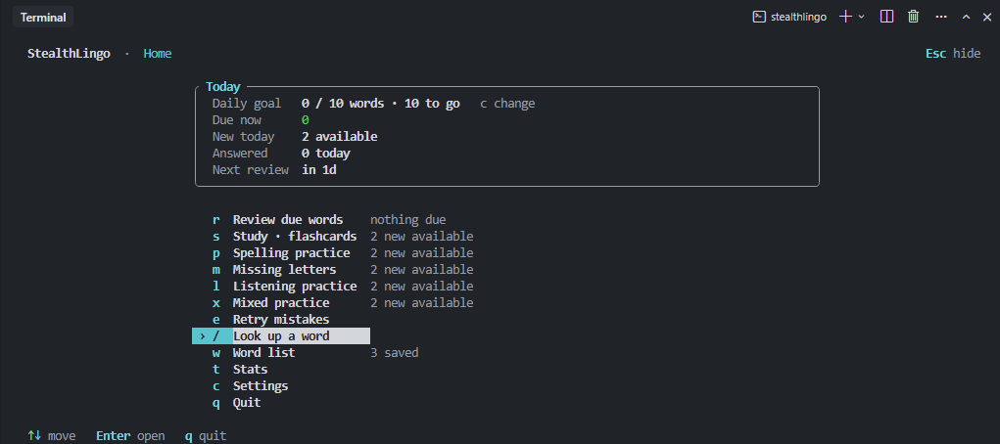
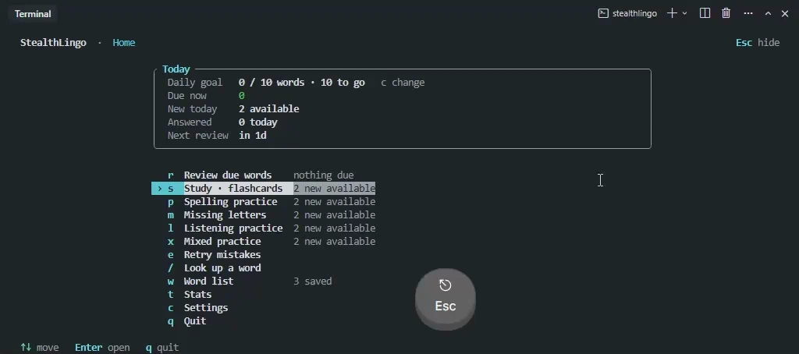
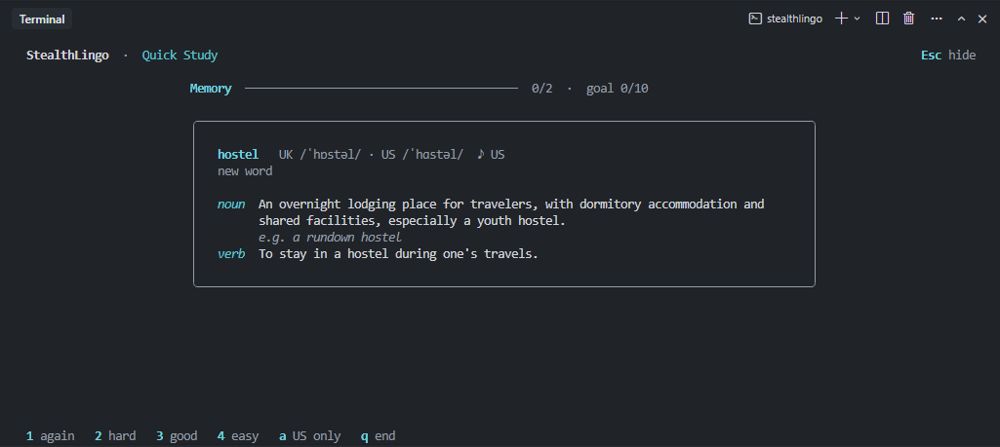
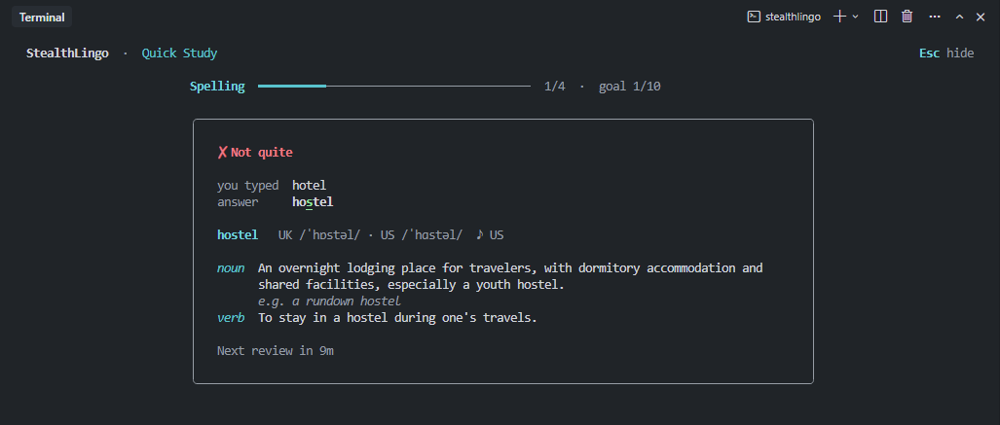
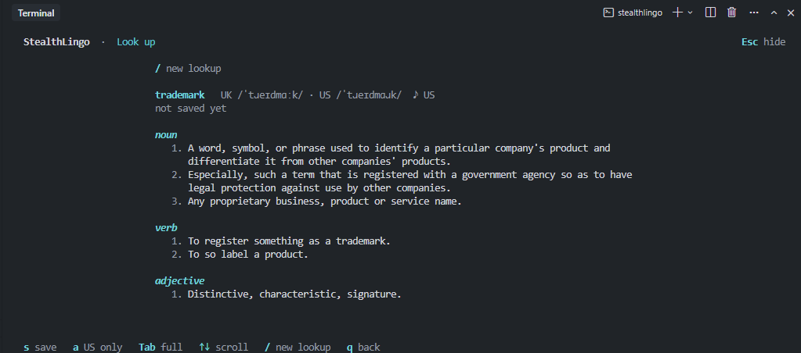

# stealthlingo

[English](../../README.md) | [简体中文](README.zh-CN.md) | **繁體中文** | [日本語](README.ja.md) | [한국어](README.ko.md) | [Español](README.es.md) | [Português (Brasil)](README.pt-BR.md) | [Русский](README.ru.md) | [Tiếng Việt](README.vi.md)

一款以終端機為主、適合悄悄學習的語言學習工具。

StealthLingo 是一個用 Rust 撰寫的小型命令列工具，讓你利用零碎時間練習單字：查一個單字、把它存起來，然後用閃卡、拼字、缺字母拼字、聽力或混合練習來記住它，朝每日單字目標前進。按 Esc 可以一下子隱藏整個介面。字典資料來自英文 [Wiktionary（維基詞典）](https://en.wiktionary.org/)，透過 Wikimedia 官方 API 取得，不需要金鑰；複習排程、答案判定和學習進度都存放在本機的 SQLite 資料庫中，因此已儲存的單字可以離線複習。AI 助理也可以在你閱讀或寫程式時，把你可能不認識的單字加入學習清單（見 [AI 助理](#ai-助理mcp)）。

v0.1 只支援學習英語。



## 安裝

[Releases 頁面](https://github.com/viys/stealthlingo/releases)提供 Windows（x64）、macOS（Intel 與 Apple 晶片）以及 Linux（x64 與 ARM64）的預先編譯程式，不需要安裝 Rust。安裝腳本會把 `stealthlingo` 和它的連結輔助程式 `stealthlingo-link` 放進 `~/.cargo/bin`，並將該資料夾加入 `PATH`。

Windows（PowerShell）：

```powershell
powershell -ExecutionPolicy Bypass -c "irm https://github.com/viys/stealthlingo/releases/latest/download/stealthlingo-installer.ps1 | iex"
```

macOS 與 Linux：

```bash
curl --proto '=https' --tlsv1.2 -LsSf https://github.com/viys/stealthlingo/releases/latest/download/stealthlingo-installer.sh | sh
```

也可以從 Releases 頁面下載對應系統的壓縮檔，解壓縮後讓 `stealthlingo` 和 `stealthlingo-link` 放在同一個資料夾裡。在 Linux 上，音訊播放使用 ALSA（`libasound2`），桌面版發行版預設都已內建。

### 從原始碼建置

需要較新的穩定版 Rust 工具鏈（1.88+）和 C 編譯器（SQLite 已內建）。

```bash
cargo install --git https://github.com/viys/stealthlingo
# 或者在複製下來的儲存庫中
cargo install --path .
cargo run -- --help
```

在 Linux 上建置還需要 ALSA 開發套件（例如 `libasound2-dev`）。

## 快速上手

```bash
stealthlingo lookup ephemeral            # 顯示發音和主要釋義（--all 顯示全部）
stealthlingo add ephemeral --note 短暫的  # 儲存單字，可附上個人筆記
stealthlingo                             # 開啟全螢幕應用程式：練習、查單字、瀏覽單字、統計
```

## 全螢幕介面

在終端機中執行 `stealthlingo`、`study` 和 `review` 會開啟全螢幕介面。首頁顯示今天該複習的內容、每日目標的進度和一個選單（`r` 複習、`s` 閃卡、`p` 拼字、`m` 缺字母拼字、`l` 聽力、`x` 混合練習、`e` 錯字重練、`/` 查單字、`w` 單字清單、`t` 統計、`c` 設定、`q` 離開）；也可以用 `↑`/`↓`（或 `k`/`j`）加 `Enter` 操作。清單和較長的頁面也用相同的按鍵捲動。



- **按 Esc 立刻隱藏所有內容**，顯示你啟動程式前的命令列；再按一次 Esc 即可回來。隱藏期間練習計時會暫停。
- **閃卡**不需要按 Enter：`Space` 顯示答案，`1`–`4` 評分，`a` 播放發音，`s` 略過，`q` 結束本次練習。
- **口音**：`a` 會先播放預設口音（`accent` 設定）；對同一個單字再按一次會播放另一種已錄製的口音，依此類推。頁尾提示下一次會播放哪種口音，頁首顯示正在播放哪種。
- **拼字與聽力**：輸入單字後按 `Enter`。`Tab` 顯示答案，`Ctrl+N` 略過。聽力練習中在空白行按 `Enter` 會重播錄音，`Ctrl+R` 播放另一種口音。答錯時會標出多了或少了哪些字母。缺字母題會顯示挖空部分字母的單字（`e _ h e _ e r _ l`），需要輸入完整單字。
- **單字清單**：`/` 依文字篩選，`s` 依序切換狀態，`p` 依序切換詞性，`u` 只顯示到期的單字。`Enter` 開啟已儲存的詞條（可離線使用），`a` 播放發音，`n` 編輯筆記，先按 `d` 再按 `y` 刪除單字（重新儲存會恢復它的學習進度）。`PgUp`/`PgDn` 和 `g`/`G` 可以在長清單中快速跳轉。AI 助理新增的單字會標記為 `agent`，選取時下方的詳細資訊會顯示助理給出的理由。
- **設定**（`c`）：`←`/`→` 調整選取的值，`PgUp`/`PgDn` 每次調整 10，`Enter` 直接輸入數字，`r` 恢復預設值，`R` 恢復全部設定。每次變更會立即儲存；超出允許範圍的值不會儲存。
- **查單字**：輸入單字後按 `Enter`；之後 `s` 儲存或刪除該單字，`a` 播放發音，`Tab` 在簡要和完整詞條之間切換，`/` 開始新的查詢，`q` 返回。
- `Ctrl+C` 會結束目前的練習、取消篩選或筆記編輯，其他情況下則離開程式。每個答案在作答後會立即儲存。
- 介面需要至少 40×12 個字元的終端機。視窗較矮時，外框會縮小，首頁摘要會壓縮成一行，選單會分成兩欄（寬視窗）或可以捲動，確保選取的項目和作答欄位始終可見。







使用 `--plain`（或輸入/輸出不是終端機，例如透過管線）時，會改用下文介紹的逐行提示模式。設定 `NO_COLOR` 可關閉色彩。

## 指令

| 指令 | 用途 |
|---|---|
| `stealthlingo` | 開啟全螢幕應用程式。加上 `--plain` 時：複習到期的單字；沒有到期單字就學習新單字；單字清單為空時說明如何開始 |
| `lookup <WORD> [--all]` | 查詢 Wiktionary（更新快取；離線時改用快取的副本） |
| `add <WORD> [--note TEXT]` | 儲存單字。重複儲存不會有副作用；`--note` 會更新筆記 |
| `remove <WORD>` | 從單字清單中移除單字（快取的字典資料和作答紀錄會保留） |
| `words [--status S] [--pos P] [--due]` | 列出已儲存的單字及其狀態、到期時間和新增者，可依條件篩選 |
| `search <QUERY> [--status S] [--pos P] [--due]` | 搜尋已儲存的單字和筆記 |
| `study [--mode memory\|spelling\|letters\|listening\|mixed] [--mistakes] [--minutes N] [--count N]` | 開始一次練習 |
| `review [--count N] [--minutes N]` | 只用閃卡複習到期的單字 |
| `stats` | 依狀態統計的已儲存單字數、到期數、每日目標和最近 7 天、今日與累計的作答數及正確率、下次複習時間 |
| `audio <WORD> [--accent uk\|us]` | 播放發音（預設使用 `accent` 設定） |
| `config` / `config set <KEY> <VALUE>` / `config reset [KEY]` | 檢視、變更或恢復設定；顯示資料位置 |
| `links [status\|install\|uninstall]` | 在 `lookup` 輸出中 Ctrl+點擊即可播放發音、新增或移除單字（Windows） |
| `export <PATH>` / `import <PATH>` | `.json` 為完整備份，`.csv` 為單字清單 |
| `mcp` | 透過 stdin/stdout 以 MCP 方式為 AI 助理提供服務；由助理的用戶端啟動（見下文 AI 助理一節） |

未指定 `--minutes` 或 `--count` 時，一次練習持續 `default_minutes`（5）分鐘。從首頁或 `stealthlingo --plain` 開始的練習則會持續到達成每日目標為止（見[每日目標](#每日目標)）。

單字清單的篩選條件可以組合：`--status` 取 `new`、`learning`、`review` 或 `mastered`；`--pos` 比對詞性的開頭（`adj`、`n`、`verb`）；`--due` 只保留已到複習時間的單字。

```bash
stealthlingo words --status learning --pos adj
stealthlingo words --due
```

`lookup` 會在一行中顯示發音，先英式後美式（`Pronunciation: UK /njuː/ · US /nu/`），並註明 `audio` 播放的是哪種口音的錄音（兩種都有時會提示使用 `--accent uk|us`）。預設接著列出最多三種詞性、每種詞性的前三條釋義。`lookup --all`（或 `-a`）會顯示所有釋義以及例句、同義詞、反義詞和來源。釋義會依終端機寬度換行，續行會縮排。

### 可點擊的查詢結果（Windows）

```bash
stealthlingo links install   # 安裝後執行一次即可
```

這會為目前使用者註冊一個 `stealthlingo://` 連結處理程式（不需要系統管理員權限）。之後 `lookup` 會把每個有錄音的發音變成終端機超連結：Ctrl+點擊即可在背景播放錄音，不會開啟瀏覽器或任何視窗。最後一行會變成 `+ Add to word list`，已儲存的單字則顯示 `Saved in your word list · Remove`；Ctrl+點擊它即可新增或移除單字，不必輸入指令（再次執行 `lookup` 可看到變化）。由於其他程式也能開啟這些連結，透過連結移除的單字會保留學習進度：之後再透過連結或 `add` 新增時，進度會恢復。而 `remove` 指令會讓該單字從頭開始。此功能需要支援超連結的終端機（Windows Terminal、VS Code / Cursor）；在其他終端機中，`lookup` 會輸出純文字，並附上對應的 `add` 和 `audio` 指令。`links status` 顯示偵測結果，`FORCE_HYPERLINK=1`（或 `0`）可覆寫偵測結果，`links uninstall` 會移除處理程式。錯誤會寫入資料目錄中的 `link-errors.log`。

### 練習模式

以下按鍵適用於逐行提示模式（`--plain`）；全螢幕介面使用上文介紹的單鍵操作。

- **memory（記憶）**：先看單字，按 Enter 顯示釋義，然後自我評分：`1` Again（忘了）、`2` Hard（困難）、`3` Good（良好）、`4` Easy（簡單）。按 `a` 聽發音。
- **spelling（拼字）**：閱讀釋義（釋義和例句中的目標單字會被遮住），然後輸入單字。`?` 表示放棄並顯示答案。
- **letters（缺字母）**：和拼字相同，但會顯示大約一半的字母（`e _ h e _ e r _ l`）。同一個單字每次挖空的位置相同。作答會記為拼字練習。
- **listening（聽力）**：聽發音並輸入單字。`r` 重播。只會使用有發音錄音的單字。
- **mixed（混合）**：從未學過的單字先以閃卡出現；其他單字在閃卡、拼字和（有錄音時）聽力之間輪替。

`--mistakes` 練習最近 30 天內答錯過的單字，以及學會後又忘記的單字，最近答錯的排在前面，不論是否到期。它可以搭配任何模式；在首頁按 `e` 會使用混合練習。

所有模式中，`s` 會略過目前的單字且不記錄答案，`q` 結束練習。Ctrl+C 也會結束練習；再按一次 Ctrl+C 會立即離開。每個送出的答案都會立即儲存，因此中途離開不會遺失已完成的部分，未作答的題目也不會被記為答錯。

答案判定會忽略大小寫和前後空白，但撇號和連字號必須一致（`well-being` 不等於 `wellbeing`）。

### 複習排程

由簡化版 SM-2 演算法決定單字何時再次出現：

- **Again**：10 分鐘後再出現；進度重設。
- **Hard**：間隔比正常更短。
- **Good**：先 1 天，再 3 天，之後間隔依該單字的難易係數（ease factor）增加。
- **Easy**：間隔更長，而且之後該單字會變得更「容易」。

拼字和聽力練習中，答對視為 Good，答錯視為 Again。答錯的單字會在同一次練習結束前再出現一次。到期的複習一律排在新單字之前，每天最多加入 `daily_new_limit`（預設 10）個從未學過的新單字。間隔達到 21 天以上的單字會顯示為 `mastered`（已熟練）。

### 每日目標

`daily_goal`（預設 10）是每天要練習的不同單字數；同一個單字重複作答不會重複計算。首頁、統計頁和 `stats` 會顯示今天的進度，`stats` 也會顯示最近 7 天的情況。在達成目標之前，從首頁（或 `stealthlingo --plain`）開始的練習會在達成目標時結束，而不是在 `default_minutes` 之後；如果單字先練完了，會提示還差幾個。明確指定的 `--minutes` 或 `--count` 一律優先。設為 `0` 會關閉目標。

## 設定

可以在設定畫面（首頁按 `c`）或用 `config` 變更設定：

```bash
stealthlingo config set daily_goal 20
stealthlingo config set daily_new_limit 15
stealthlingo config set default_minutes 3
stealthlingo config set accent us        # 優先播放美式錄音（預設：uk）
stealthlingo config reset daily_goal     # 恢復預設值
stealthlingo config reset                # 確認後恢復全部設定（--yes 略過確認）
```

| 鍵 | 預設值 | 範圍 | 意義 |
|---|---|---|---|
| `daily_goal` | 10 | 0–500，0 = 關閉 | 每天練習的不同單字數 |
| `daily_new_limit` | 10 | 0–200，0 = 只複習 | 每天加入的從未學過的新單字數 |
| `default_minutes` | 5 | 1–120 | 未指定 `--minutes` 或 `--count` 時一次練習的長度 |
| `accent` | uk | uk / us | 優先播放的口音 |
| `mcp_daily_add_limit` | 30 | 0–200，0 = 關閉 | AI 助理每天最多可透過 MCP 新增的單字數 |
| `http_timeout_secs` | 10 | 1–120 | 網路逾時 |

`config` 會列出每個值及其預設值和範圍。如果 `config.json` 中的值超出範圍，StealthLingo 會發出警告並以最接近的允許值執行，不會改寫檔案。只有一種口音錄音的單字一律播放該錄音。

### 字典

StealthLingo 使用 Wikimedia 官方的 Wiktionary API：釋義和例句來自 REST API，國際音標（依口音標註）、同義詞、反義詞和 Wikimedia Commons 錄音（OGG）則來自頁面原始碼。當輸入的形式與字典詞條不同時（例如 `Ephemeral` 和 `ephemeral`），會記住輸入的形式，因此 `add` 和 `remove` 指的是同一個已儲存的單字。

v0.1.0 發布之前的開發版本也可以使用 Free Dictionary API 或 Merriam-Webster。從這些來源快取的單字仍可離線檢視，並會在下次查詢時替換為 Wiktionary 資料（學習進度和筆記會保留）。`config.json` 中對應的舊設定會被忽略。

## AI 助理（MCP）

`stealthlingo mcp` 在 stdin/stdout 上執行一個 [Model Context Protocol](https://modelcontextprotocol.io) 伺服器，讓 AI 助理（Cursor、Claude Desktop 或其他 MCP 用戶端）在你閱讀或寫程式時查詢單字，並把你可能不認識的單字加入學習清單。StealthLingo 本身從不呼叫 AI 模型。把它加入用戶端的 MCP 設定（Cursor 為 `~/.cursor/mcp.json`，或專案中的 `.cursor/mcp.json`）：

```json
{
  "mcpServers": {
    "stealthlingo": {
      "command": "stealthlingo",
      "args": ["mcp"]
    }
  }
}
```

如果 `stealthlingo` 不在 `PATH` 中，把 `command` 寫成執行檔的完整路徑。之後就可以請助理幫忙，例如把這一頁裡你可能不認識的單字加入學習清單。

| 工具 | 作用 |
|---|---|
| `get_study_status` | 已儲存、到期和尚未開始學習的單字數，今天的目標進度和正確率，以及助理今天還能新增多少個單字 |
| `list_words` | 已儲存的單字及其狀態、到期時間、是否有音訊、遺忘次數和簡短釋義；可用 `query`、`status` 和 `limit` 縮小範圍。筆記永遠不會提供給助理 |
| `lookup_word` | 單字的 Wiktionary 詞條（優先使用快取），不會儲存該字 |
| `add_words` | 每次最多儲存 20 個單字，每個可附帶選用的 `reason`；逐字回報結果 |

助理只能挑選單字：

- 釋義、例句和發音只來自 Wiktionary。助理可以說明單字出現在哪裡（`reason`），但不能寫入釋義、翻譯或你的筆記。Wiktionary 沒有收錄的單字不會被新增。
- 沒有刪除單字、修改設定或記錄作答的工具。
- 你刪除過的單字（透過 `remove`、單字清單中的 `d` 或連結）永遠不會被助理加回來；你自己重新儲存後才會解除這項限制。
- 助理每天最多新增 `mcp_daily_add_limit`（預設 30）個單字，刪除其中的單字不會退還名額。設為 `0` 禁止新增。修改在下一次呼叫時生效，不需要重新啟動用戶端。
- 助理新增的單字和其他單字一樣參與練習。單字清單會把它們標記為 `agent` 並顯示助理給出的理由；`words` 在 `BY` 欄顯示每個單字由誰新增。JSON 備份會保留這兩項資訊，以及你刪除過的單字。

## 資料目錄

`stealthlingo config` 會印出確切路徑。預設位置：

| 作業系統 | 位置 |
|---|---|
| Windows | `%APPDATA%\stealthlingo\data` |
| macOS | `~/Library/Application Support/stealthlingo` |
| Linux | `~/.local/share/stealthlingo` |

設定 `STEALTHLINGO_HOME` 可改用其他目錄（適合可攜式使用或做實驗）。該目錄包含 `stealthlingo.db`（SQLite，具版本化遷移）、`config.json` 和 `audio/`（已下載的發音檔）。

### 備份與單字清單

```bash
stealthlingo export backup.json   # 所有內容：快取、進度、作答紀錄
stealthlingo import backup.json   # 合併匯入；重複匯入同一個檔案不會有任何變化
stealthlingo export words.csv     # word、note、status、due_at、definition
stealthlingo import examples/words.csv   # 使用 "word" 欄（沒有則用第一欄）；"note" 欄為選用
```

JSON 匯入時，若同一個單字在兩邊都存在，以最近複習過的進度為準。CSV 匯入會查詢每個尚未快取的單字，因此需要網路連線。

## 離線行為

- 練習、複習、`words`、`search` 和 `stats` 從不存取網路。
- `lookup` 會從 Wiktionary 更新資料，無法連線時顯示快取的副本。
- `add` 和 `audio` 盡量使用快取，只有遇到新單字時才連線。
- `mcp` 中，`get_study_status` 和 `list_words` 從不存取網路；`lookup_word` 和 `add_words` 只在單字尚未快取時連線。
- 發音音訊在第一次播放時下載，之後重複使用。

## 關於字典資料

- 詞條附有來源 URL 和授權條款，可透過 `lookup --all` 檢視。Wiktionary 內容採用 CC BY-SA 4.0 授權。
- 不同單字的資料完整度不一：音標、音訊、例句、同義詞和反義詞都可能缺少。StealthLingo 將每個欄位都視為選用；沒有音訊的單字會在聽力練習中被略過。
- Wiktionary 不是翻譯服務。中文（或其他語言）提示來自你自己的 `--note`，而不是字典。
- 此服務免費，可能較慢或暫時無法使用。請遵守 Wikimedia 的使用條款，未符合授權要求時請勿大量散布快取資料。

## 開發

```bash
cargo test
cargo clippy --all-targets -- -D warnings
cargo fmt --check
```

程式碼分為 `dictionary`（Wiktionary 用戶端和剖析器，對應到 `Entry` 模型，另有一個解碼器用來讀取發布前開發版本快取的資料）、`storage`（SQLite）、`learning`（複習排程、答案判定、練習階段）、`audio`、`commands` 和 `tui`（以 ratatui 打造的全螢幕介面）。兩種介面驅動的是同一個 `learning::session::Session`。複習排程是一個純函式，在 `tests/scheduling_tests.rs` 中有獨立的測試。

### 發布

發布由 [dist](https://github.com/axodotdev/cargo-dist) 建置（`dist-workspace.toml`、`.github/workflows/release.yml`）。先修改 `Cargo.toml` 中的 `version` 並提交，然後推送對應的標籤：

```bash
git tag v0.2.0
git push origin v0.2.0
```

接著 GitHub Actions 會建置所有平台，並將壓縮檔和安裝腳本發布為 GitHub Release。`dist plan` 可以預覽將要建置的內容；修改 `dist-workspace.toml` 後，執行 `dist generate` 更新工作流程。

## 授權條款

MIT，詳見 [LICENSE](../../LICENSE)。
